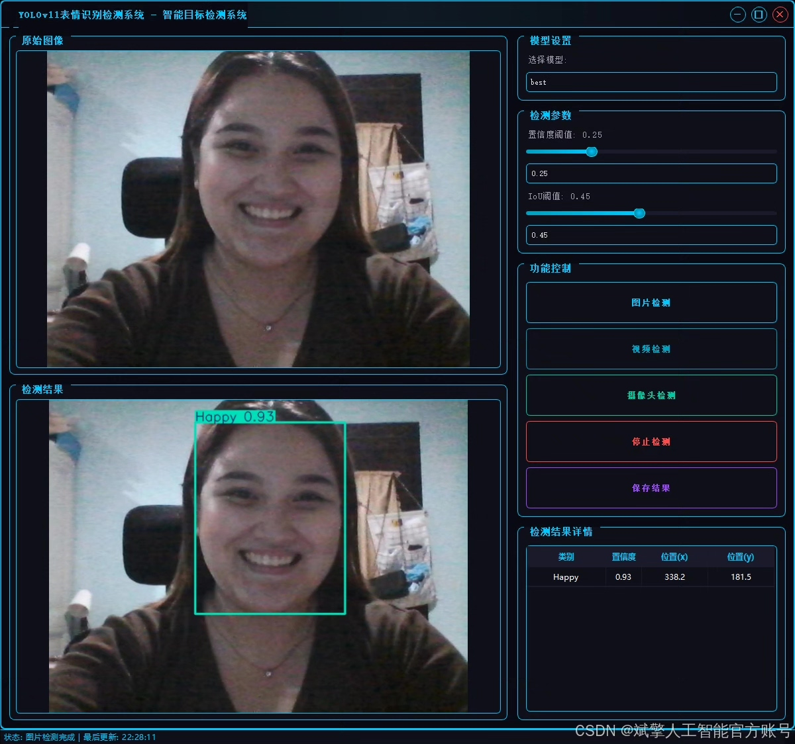
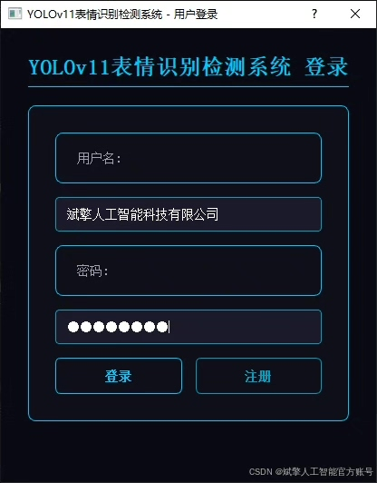
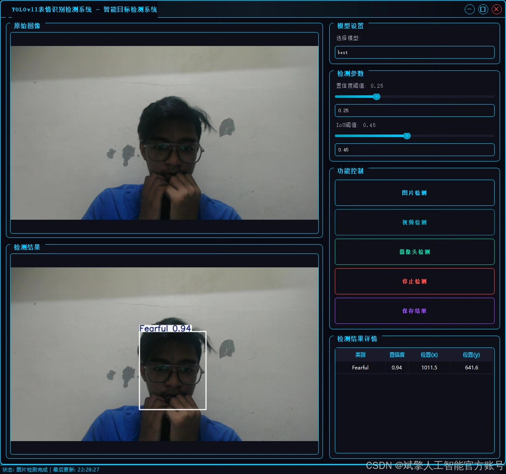
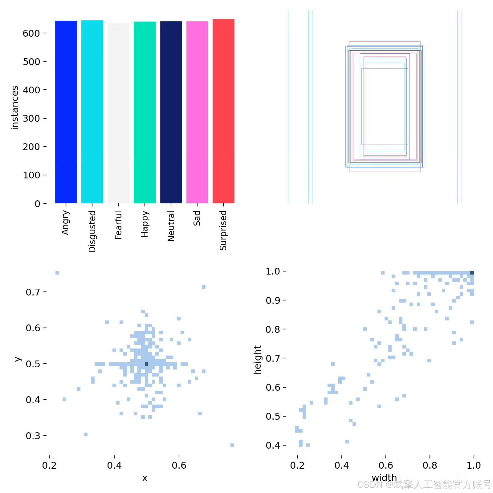
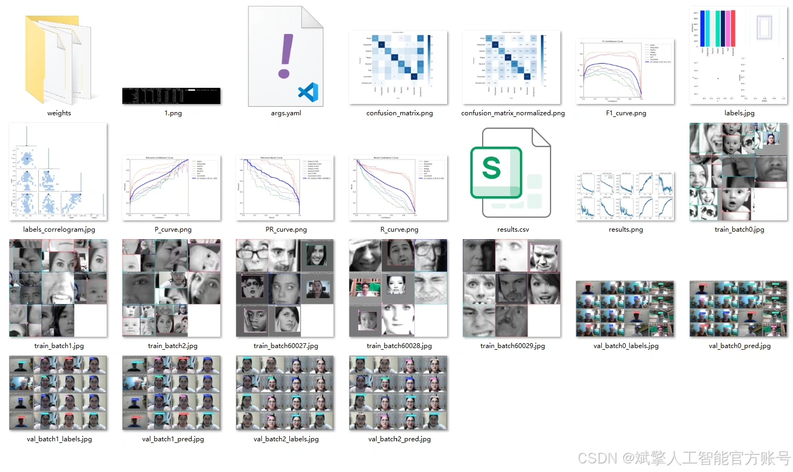
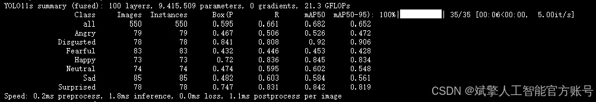
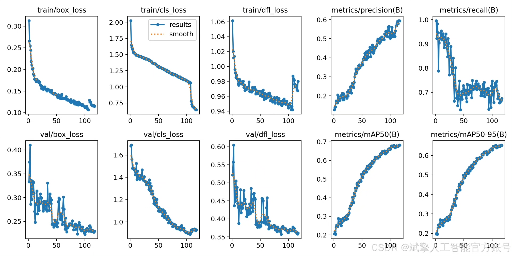
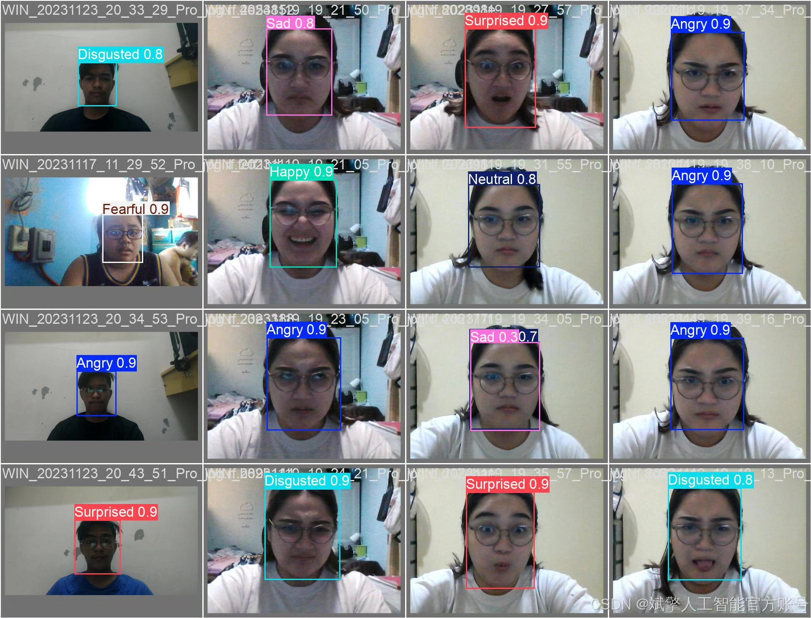

# YOLOv11 Emotion Recognition System

## Body

YOLOv11 Emotion Recognition System Based on Deep Learning YOLOv11 Emotion Recognition Detection System (YOLOv11+YOLO dataset + UI interface + login registration interface + Python project source code + model)

nc: 7 classes,
Name: ['Angry', 'Disgusted', 'Fearful', 'Happy', 'Neutral', 'Sad', 'Surprised'],
Dataset quantity: training set 4483 images, validation set 550 images, test set 566 images.

✅ User login registration: Supports password detection and security verification.

✅ Three detection modes: based on the YOLOv11 model, supports image, video, and real-time camera three detection, accurate recognition of targets.

✅ Dual screen comparison: Display original images and detection results in the same screen.

✅ Data visualization: Real-time table displaying the category, confidence, and coordinates of detected targets.

✅ Intelligent parameter adjustment: Provides a confidence slide bar, dynamically optimizes detection accuracy to meet different scene needs.

✅ Sci-fi style interactive interface: Dark theme combined with dynamic light effects, reduces visual fatigue, improves operational experience.

## Images

## Payment

Here is a pay link on Stripe ( https://buy.stripe.com/3cs8yP7sY87d0vu9AB ). Please contact me lonlonago@foxmail.com after funding $89, and I will send you a complete data files , thank you!

